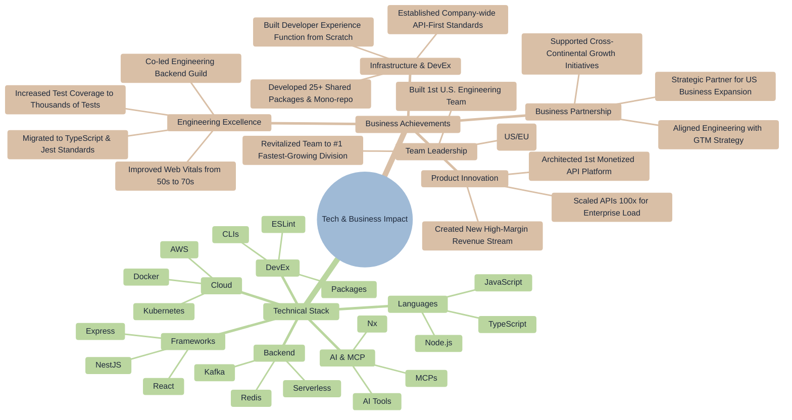

# 🚀 Ofri Peretz

> **Building Products That Matter • Engineering Leadership • Open-Source Contributor**

---

## 🎯 Where I Find Myself Today

Leading Snappy's U.S. engineering expansion. Building distributed teams, architecting revenue-generating API platforms, and establishing scalable infrastructure.

**🔥 Currently revolutionizing the ESLint plugin ecosystem for the AI/Agentic era — building LLM-optimized, security-first static analysis tools that empower both human developers and AI coding assistants.**

If I would need to explain my current level of experience it would be around [**IC5/M2±**](https://mui-org.notion.site/Leveling-at-MUI-5c30f9bfe65149d697f346447cef9db1).

I value craftsmanship in both code and culture. Whether it's writing clean, testable code or fostering environments where diverse perspectives lead to better outcomes - I find fulfillment in the details that create lasting impact.

---

## 📦 Interlace ESLint Ecosystem

**AI-native security plugins with LLM-optimized error messages**

### 🔐 Security Plugins

| Package                                                                                          | Description                                                            | Downloads                                                            |
| ------------------------------------------------------------------------------------------------ | ---------------------------------------------------------------------- | -------------------------------------------------------------------- |
| [`eslint-plugin-secure-coding`](https://www.npmjs.com/package/eslint-plugin-secure-coding)       | 89 AI-parseable rules, OWASP Top 10 2021 + Mobile 2024 coverage        |     |
| [`eslint-plugin-jwt`](https://www.npmjs.com/package/eslint-plugin-jwt)                           | JWT security: algorithm confusion, weak secrets, library-specific CVEs |               |
| [`eslint-plugin-crypto`](https://www.npmjs.com/package/eslint-plugin-crypto)                     | 24 rules for cryptographic best practices and CVE detection            |            |
| [`eslint-plugin-pg`](https://www.npmjs.com/package/eslint-plugin-pg)                             | PostgreSQL driver security and best practices                          |                |
| [`eslint-plugin-browser-security`](https://www.npmjs.com/package/eslint-plugin-browser-security) | XSS, postMessage abuse, storage token exposure, CSP                    |  |

### 🖥️ Framework Security

| Package                                                                                              | Description                                                | Downloads                                                              |
| ---------------------------------------------------------------------------------------------------- | ---------------------------------------------------------- | ---------------------------------------------------------------------- |
| [`eslint-plugin-nestjs-security`](https://www.npmjs.com/package/eslint-plugin-nestjs-security)       | Guards, validation pipes, throttling, sensitive fields     |     |
| [`eslint-plugin-express-security`](https://www.npmjs.com/package/eslint-plugin-express-security)     | Cookies, CORS, CSRF, GraphQL security                      |    |
| [`eslint-plugin-lambda-security`](https://www.npmjs.com/package/eslint-plugin-lambda-security)       | AWS Lambda and Middy security patterns                     |     |
| [`eslint-plugin-vercel-ai-security`](https://www.npmjs.com/package/eslint-plugin-vercel-ai-security) | Vercel AI SDK security for generateText, streamText, tools |  |

### ⚛️ React Ecosystem

| Package                                                                                      | Description                                    | Downloads                                                          |
| -------------------------------------------------------------------------------------------- | ---------------------------------------------- | ------------------------------------------------------------------ |
| [`eslint-plugin-react-a11y`](https://www.npmjs.com/package/eslint-plugin-react-a11y)         | 37 LLM-optimized rules for WCAG 2.1 compliance |      |
| [`eslint-plugin-react-features`](https://www.npmjs.com/package/eslint-plugin-react-features) | Modern React features, hooks, and patterns     |  |

### 🏗️ Architecture & Quality

| Package                                                                                  | Description                                                              | Downloads                                                        |
| ---------------------------------------------------------------------------------------- | ------------------------------------------------------------------------ | ---------------------------------------------------------------- |
| [`eslint-plugin-import-next`](https://www.npmjs.com/package/eslint-plugin-import-next)   | 100x faster no-cycle detection, drop-in eslint-plugin-import replacement |   |
| [`eslint-plugin-architecture`](https://www.npmjs.com/package/eslint-plugin-architecture) | DDD, API boundaries, and project structure                               |  |
| [`eslint-plugin-quality`](https://www.npmjs.com/package/eslint-plugin-quality)           | Code health, error handling, complexity management                       |       |

### 🛠️ Core Infrastructure

| Package                                                                              | Description                                                    | Downloads                                                      |
| ------------------------------------------------------------------------------------ | -------------------------------------------------------------- | -------------------------------------------------------------- |
| [`@interlace/eslint-devkit`](https://www.npmjs.com/package/@interlace/eslint-devkit) | AST helpers, type utilities, security benchmarks, SARIF output |  |

---

## 📦 Other Packages

| Package                                                                                    | Downloads                                                         |
| ------------------------------------------------------------------------------------------ | ----------------------------------------------------------------- |
| [`eslint-plugin-llm-optimized`](https://www.npmjs.com/package/eslint-plugin-llm-optimized) |  |
| [`eslint-plugin-llm`](https://www.npmjs.com/package/eslint-plugin-llm)                     |            |
| [`eslint-plugin-mcp`](https://www.npmjs.com/package/eslint-plugin-mcp)                     |            |
| [`eslint-plugin-mcp-optimized`](https://www.npmjs.com/package/eslint-plugin-mcp-optimized) |  |
| [`pmac`](https://www.npmjs.com/package/pmac)                                               |                         |

---

## 🤝 Let's Connect

- **GitHub**: [@ofri-peretz](https://github.com/ofri-peretz)
- **LinkedIn**: [Ofri Peretz](https://www.linkedin.com/in/ofri-peretz/)

---

## 🛠️ Tech Stack & Impact

