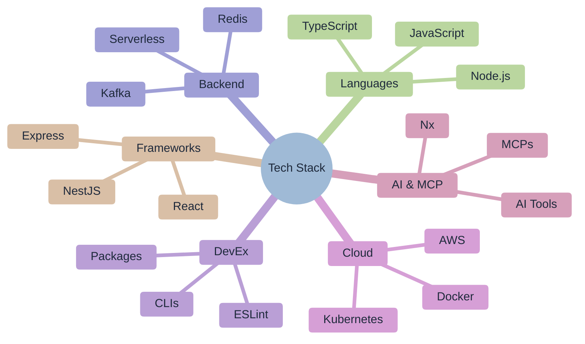

# 🚀 Ofri Peretz

> **Building Products That Matter • Engineering Leadership • Open-Source Contributor**

---

## 🎯 Where I Find Myself Today

Leading Snappy's U.S. engineering expansion. Building distributed teams, architecting revenue-generating API platforms, and establishing scalable infrastructure.

If I would need to explain my current level of experience it would be around **IC5±**.

I value craftsmanship in both code and culture. Whether it's writing clean, testable code or fostering environments where diverse perspectives lead to better outcomes - I find fulfillment in the details that create lasting impact.

---

## 📦 Featured Packages

| Package                                                                                                        | Downloads                                                                   |
| -------------------------------------------------------------------------------------------------------------- | --------------------------------------------------------------------------- |
| [`@forge-js/eslint-plugin-llm-optimized`](https://www.npmjs.com/package/@forge-js/eslint-plugin-llm-optimized) |  |
| [`@forge-js/eslint-plugin-utils`](https://www.npmjs.com/package/@forge-js/eslint-plugin-utils)                 |          |
| [`@forge-js/cli`](https://www.npmjs.com/package/@forge-js/cli)                                                 |                          |
| [`eslint-plugin-llm-optimized`](https://www.npmjs.com/package/eslint-plugin-llm-optimized)                     |            |
| [`eslint-plugin-mcp`](https://www.npmjs.com/package/eslint-plugin-mcp)                                         |                      |
| [`eslint-plugin-mcp-optimized`](https://www.npmjs.com/package/eslint-plugin-mcp-optimized)                     |            |
| [`pmac`](https://www.npmjs.com/package/pmac)                                                                   |                                   |

---

## 🤝 Let's Connect

- **GitHub**: [@ofri-peretz](https://github.com/ofri-peretz)
- **LinkedIn**: [Ofri Peretz](https://www.linkedin.com/in/ofri-peretz/)

---

## 🛠️ Tech Stack

