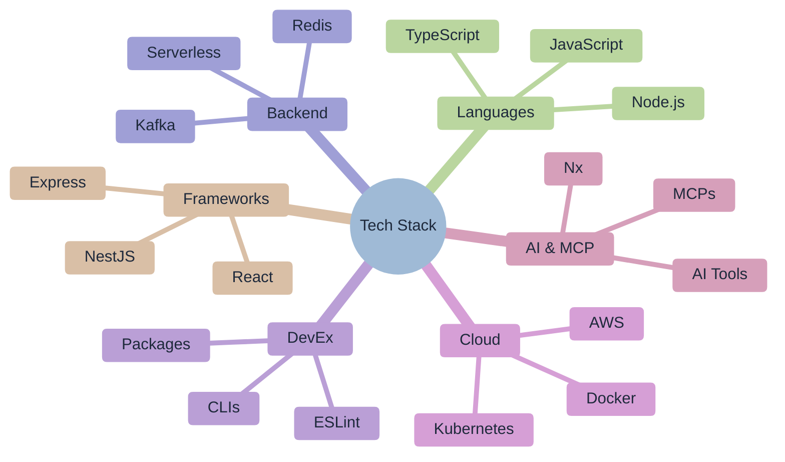

# 🚀 Ofri Peretz

> **Building Products That Matter • Engineering Leadership • Open-Source Contributor**

---

## 🎯 Passionate About Building

I love **creating products and tools that solve real problems** at scale. Whether it's developing mission-critical systems, leading engineering teams, or building open-source tools that thousands of developers use - I thrive on turning complex challenges into elegant solutions.

**My Mission**: Use technology to amplify human potential and create systems that make people's lives better, whether through innovative products or developer tools that boost productivity.

---

## 💼 My Engineering Journey

### 🌟 Building Teams & Products That Scale

I'm currently leading the charge to establish Snappy's first U.S. engineering presence in Austin, Texas. It's been an incredible challenge - relocating across the world to build a team from scratch, figuring out how to make distributed collaboration actually work across time zones, and becoming the technical bridge between engineering and business teams.

What gets me excited is seeing how small changes in developer experience can create massive impact. I built our Developer Experience function from the ground up, creating tools and processes that made everyone's life easier. That Compass metrics portal I launched? It completely changed how we think about engineering productivity.

### 🚀 Creating Products That Matter

One of my proudest moments was architecting Snappy's first monetized API platform. We went from zero to a full product line generating real revenue from enterprise clients. But what mattered most was the team transformation - taking a struggling group and turning them into the fastest-growing division in the company.

I love the challenge of scaling systems. Taking APIs from serving hundreds to handling enterprise-scale traffic, writing thousands of tests to ensure reliability, and establishing standards that everyone rallies around. It's not just about the code - it's about creating the foundation for sustainable growth.

### 💡 What Drives My Work

I believe in engineering as a craft that serves both technical excellence and human needs. Whether it's mentoring developers to think bigger, bridging the gap between engineering metrics and business outcomes, or creating tools that make complex systems simpler - I thrive on problems that require both technical depth and human insight.

My journey has taught me that the best solutions come from understanding people as much as understanding code. That's what keeps me passionate about building teams and products that create lasting impact.

---

## 🛠️ Technical Expertise & Current Projects

### 💻 Technology Stack

### 🚀 Current Projects

I'm currently building [**Forge.js**](https://github.com/ofri-peretz/forge-js) - an open-source ecosystem of developer tools focused on improving code quality and team velocity. This includes ESLint plugins, CLI tools, and monorepo frameworks that help teams scale efficiently.

### 🎯 Where I Find Myself Today

I've reached a point in my career where the technical challenges excite me just as much as the human ones. Leading distributed teams across continents, building products that serve real business needs, and creating environments where engineers can do their best work - these are the aspects that keep me energized.

What matters to me most is the intersection of technology and humanity. I believe the best engineering happens when we understand that behind every system, API, and deployment, there are people who depend on that technology working reliably. My work is driven by creating solutions that are not just technically sound, but also serve human needs and enable others to do meaningful work.

### 🧭 My Leadership Philosophy

I think deeply about how engineering organizations scale and thrive. In my recent writing about engineering vision for 2025, I explored how exponential growth requires exponential thinking - understanding that technical decisions have compounding effects on team velocity and business outcomes.

What fascinates me is the interplay between incentives, ownership, and expertise. I believe teams should become domain experts rather than generalists, with clear north star metrics that align their work with business success. The most powerful engineering organizations aren't built on perfect code, but on systems that enable teams to move fast, make autonomous decisions, and focus their expertise where it matters most.

Whether it's centralizing frontend infrastructure to eliminate duplication, embracing proven best practices over reinventing solutions, or creating the conditions for teams to become true experts in their domains - I find fulfillment in designing the systems and cultures that allow engineering excellence to flourish at scale.

---

## 📦 Published Packages

| Package                                                                                                        | Version                                                                                                                                           | Weekly Downloads                                                            | Description                                                        |
| -------------------------------------------------------------------------------------------------------------- | ------------------------------------------------------------------------------------------------------------------------------------------------- | --------------------------------------------------------------------------- | ------------------------------------------------------------------ |
| [`@forge-js/eslint-plugin-llm-optimized`](https://www.npmjs.com/package/@forge-js/eslint-plugin-llm-optimized) |  |  | ESLint plugin with LLM-optimized rules for AI-assisted development |
| [`@forge-js/eslint-plugin-utils`](https://www.npmjs.com/package/@forge-js/eslint-plugin-utils)                 |                  |          | Utilities and helpers for building TypeScript-based ESLint plugins |
| [`@forge-js/cli`](https://www.npmjs.com/package/@forge-js/cli)                                                 |                                                  |                          | CLI tools for the Forge ecosystem                                  |
| [`eslint-plugin-llm-optimized`](https://www.npmjs.com/package/eslint-plugin-llm-optimized)                     |                      |            | ESLint rules optimized for Large Language Models                   |
| [`eslint-plugin-mcp`](https://www.npmjs.com/package/eslint-plugin-mcp)                                         |                                          |                      | ESLint rules optimized for Model Context Protocol                  |
| [`eslint-plugin-mcp-optimized`](https://www.npmjs.com/package/eslint-plugin-mcp-optimized)                     |                      |            | MCP rules with enhanced optimization                               |

### 📊 Development Philosophy

| Principle            | Implementation                    | Impact                     |
| -------------------- | --------------------------------- | -------------------------- |
| **Quality First**    | Comprehensive testing, TypeScript | Fewer bugs, better DX      |
| **Scale Ready**      | Monorepo patterns, Nx tooling     | Teams can grow efficiently |
| **AI-Enhanced**      | LLM-optimized code and docs       | Faster development cycles  |
| **Community Driven** | Open issues, responsive PRs       | Collective improvement     |

---

## 🤝 Let's Connect

I'm always excited to discuss:

- **Engineering Leadership** - Scaling teams and processes
- **Developer Tools** - Building better development experiences
- **Open-Source** - Contributing to the developer community
- **Technology Strategy** - Planning for scale and growth

### 📫 Reach Out

- **GitHub**: [@ofri-peretz](https://github.com/ofri-peretz)
- **LinkedIn**: [Ofri Peretz](https://www.linkedin.com/in/ofri-peretz/)
- **Email**: Let's connect for meaningful conversations!

---

## 🎨 Personal Interests

Beyond code, I'm passionate about:

- **Urban Planning** & Community Development
- **Social Impact** & Accessibility
- **Continuous Learning** & Technology Innovation
- **Team Building** & Leadership Development

---

> _"Code is poetry in motion. I write tools that help others write better poetry."_

---

_Made with ❤️ and TypeScript • Building the future, one commit at a time_
