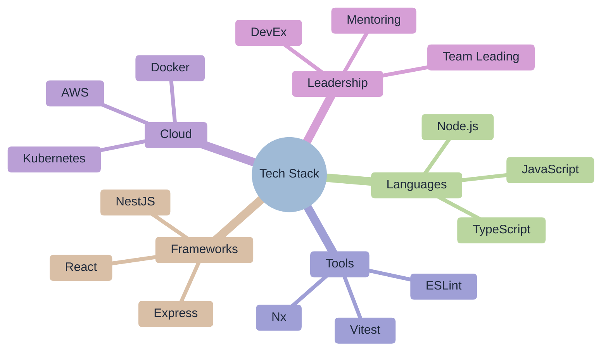

# 🚀 Ofri Peretz

> **Building Products That Matter • Engineering Leadership • Open-Source Contributor**

[](https://www.typescriptlang.org/)
[](https://nodejs.org/)
[](https://www.linkedin.com/in/ofri-peretz/)

---

## 🎯 Passionate About Building

I love **creating products and tools that solve real problems** at scale. Whether it's developing mission-critical systems, leading engineering teams, or building open-source tools that thousands of developers use - I thrive on turning complex challenges into elegant solutions.

**My Mission**: Use technology to amplify human potential and create systems that make people's lives better, whether through innovative products or developer tools that boost productivity.

---

## 💼 Professional Journey

### 🏢 Current: U.S. Site Engineering Manager at Snappy

**Austin, Texas, United States** • Oct 2024 - Present • 1 yr 2 mos

Leading Snappy's U.S. expansion by building the first American engineering team from the ground up. Managing the largest distributed team across US/EU locations, establishing operational procedures for accelerated product delivery, and serving as the primary technical partner for U.S. business leadership.

### 🔬 Leadership Experience at Snappy

#### **DevEx Team Lead** • Dec 2022 - Present • 3 yrs
Built Developer Experience function from scratch, launched Compass metrics portal, and modernized infrastructure with 25+ shared packages and mono-repo architecture.

#### **Engineering Team Lead, API & Integrations** • Sep 2023 - Nov 2024 • 1 yr 3 mos
Architected first-ever Monetized API platform creating new revenue streams, and transformed team into fastest-growing division serving Fortune 500 clients.

#### **Full Stack Engineer** • 2021 - Dec 2022 • 2 yrs
Led TypeScript migration, scaled APIs 100x with comprehensive testing (1,000+ tests), and co-led Engineering Backend Guild elevating technical standards.

### 🎯 Key Achievements & Impact

- **Team Building**: Hired and mentored foundational U.S. engineering team
- **Product Innovation**: Launched revenue-generating API platform from concept to production
- **Infrastructure Modernization**: 25+ shared packages, mono-repo architecture, API governance
- **Scale & Performance**: 100x API growth with enterprise-grade reliability
- **Cross-Continental Leadership**: Managing distributed teams across US/EU timezones

---

## 🛠️ Technical Expertise & Current Projects

### 💻 Technology Stack



### 🚀 Current Projects

I'm currently building [**Forge.js**](https://github.com/ofri-peretz/forge-js) - an open-source ecosystem of developer tools focused on improving code quality and team velocity. This includes ESLint plugins, CLI tools, and monorepo frameworks that help teams scale efficiently.

### 🎯 Key Skills & Specializations

- **Full-Stack Development** - End-to-end product development
- **Engineering Leadership** - Building and mentoring high-performing teams
- **Developer Experience** - Creating tools that boost productivity
- **Scalable Architecture** - Systems that grow with business needs
- **Open-Source Contribution** - Building tools for the developer community

---

## 📈 GitHub Stats & Activity

```text
🔥 Active Projects: 10+ repositories
📦 NPM Packages: 5+ published
⭐ Total Stars: 2
🚀 Recent Focus: ESLint plugins, developer tooling
```

### 📊 Development Philosophy

| Principle            | Implementation                    | Impact                     |
| -------------------- | --------------------------------- | -------------------------- |
| **Quality First**    | Comprehensive testing, TypeScript | Fewer bugs, better DX      |
| **Scale Ready**      | Monorepo patterns, Nx tooling     | Teams can grow efficiently |
| **AI-Enhanced**      | LLM-optimized code and docs       | Faster development cycles  |
| **Community Driven** | Open issues, responsive PRs       | Collective improvement     |

---

## 🤝 Let's Connect

I'm always excited to discuss:

- **Engineering Leadership** - Scaling teams and processes
- **Developer Tools** - Building better development experiences
- **Open-Source** - Contributing to the developer community
- **Technology Strategy** - Planning for scale and growth

### 📫 Reach Out

- **GitHub**: [@ofri-peretz](https://github.com/ofri-peretz)
- **LinkedIn**: [Ofri Peretz](https://www.linkedin.com/in/ofri-peretz/)
- **Email**: Let's connect for meaningful conversations!

---

## 🎨 Personal Interests

Beyond code, I'm passionate about:

- **Urban Planning** & Community Development
- **Social Impact** & Accessibility
- **Continuous Learning** & Technology Innovation
- **Team Building** & Leadership Development

---

> _"Code is poetry in motion. I write tools that help others write better poetry."_

---

_Made with ❤️ and TypeScript • Building the future, one commit at a time_
